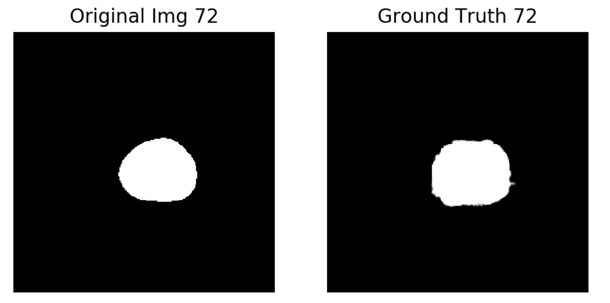

# Attn-Unet-Prostate-Segmentation

This is my Keras implementation of prostate MR images segmentation with **Attention UNet**(UNet with attention gates to make training foucus on Region of Interest)    
Tested on Promise12 dataset, got DSC of **0.812**   

## Run this net
* Download the promise12 dataset: [download](https://promise12.grand-challenge.org/download/)   
  *know about the competition: [Promise12](https://promise12.grand-challenge.org/)*

* Put the training data in the folder data/train/ and unzip

* Run the main code at codes/main.py

## Environment
* Python3
* Required packages:
  * Keras 2.2.4
  * SKlearn
  * scipy
  * scikit image
  * matplotlib
  * Python-OpenCV   

You can manage your python environment easily with [Anaconda](https://www.anaconda.com/), and you can find the required packages with [PYPI](https://pypi.org/)

## Segmentated images

>Thanks to Nabsabraham and her [focal-tversky-unet](https://github.com/nabsabraham/focal-tversky-unet) !
